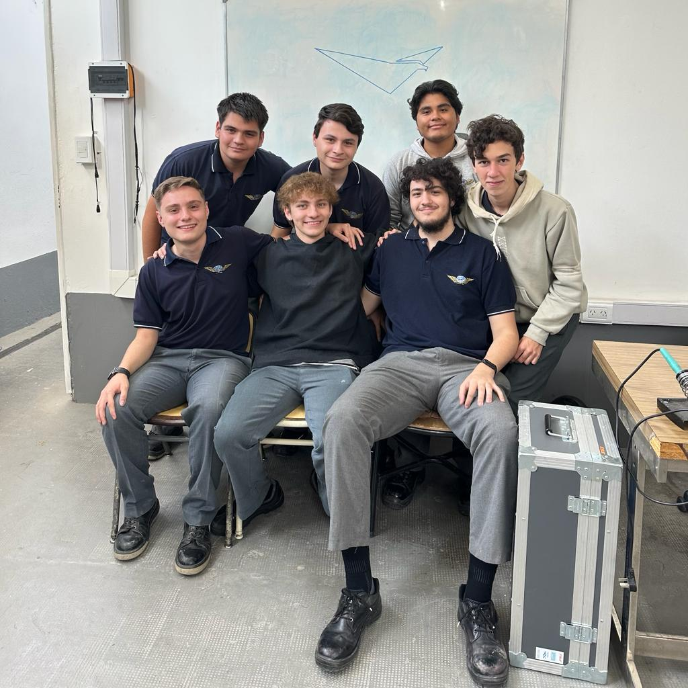

# AeroAlert

## ¿Qué es AeroAlert?

Aeroalert 

## ¿Quiénes lo desarrollan?
AeroAlert es un proyecto en proceso realizado por alumnos del 7mo Año de la Escuela de Educación Secundaria Técnica N°7 "Taller Regional Quilmes", especialidad Aviónica.

## Integrantes

### Mauro Altinier
    📷 Instagram: 
    📧 Email: 
### Juan Cuccaro
    📷 Instagram: @cuccaro_juan
    📧 Email: manucucca10@gmail.com
### 
    📷 Instagram:
    📧 Email:
### Teo Lopez
    📷 Instagram: @nico67676
    📧 Email: teonicolaslopez7@gmail.com
### Jonás Pagano
    📷 Instagram: @jonaspagano
    📧 Email: paganojonas@gmail.com
### Leandro Roca
    📷 Instagram: @lean_ro64
    📧 Email:leandroroca49@gmail.com 
### Nicolás Ruíz 
    📷 Instagram: @nicoo__ruiz
    📧 Email: ruizagustinnicolas20@gmail.com

## Contactos
Ante cualquier duda u opinión acerca de nuestro proyecto, no dudes en contactarte con nosotros a través de:

    📧 Email: proyectoaeroalert@gmail.com
    🌐 Página Web: en proceso...
    📷 Instagram: @aeroalert.impa
    🗞️ LinkedIn: https://www.linkedin.com/company/aeroalert/
