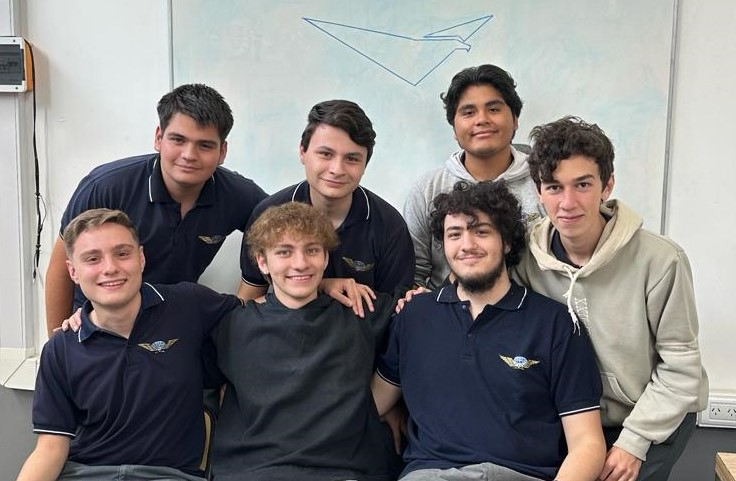

# AeroAlert

## Qué es y cuál es su fin?

Aeroalert 

## Quiénes lo desarrollan?
AeroAlert es un proyecto en proceso realizado por alumnos de la Escuela Secundaria IMPA de 7mo 1ra Avionica.

## Integrantes

### 
    📷 Instagram: 
    📧 Email: 
### Juan Cuccaro
    📷 Instagram: @cuccaro_juan
    📧 Email: manucucca10@gmail.com
### 
    📷 Instagram:
    📧 Email:
### 
    📷 Instagram:
    📧 Email: 
### Jonás Pagano
    📷 Instagram: @jonaspagano
    📧 Email: paganojonas@gmail.com
### Leandro Roca
    📷 Instagram: @lean_ro64
    📧 Email:leandroroca49@gmail.com 
### Nicolás Ruíz 
    📷 Instagram: @nicoo__ruiz
    📧 Email: ruizagustinnicolas20@gmail.com

## Cómo contactarnos
Si tenes opiniones o dudas sobre el proyecto que nos puedan ayudar, no dudes en ponerte en contacto con nosotros:

    📧 Email: proyectoaeroalert@gmail.com
    🌐 Página Web: en proceso...
    📷 Instagram: @aeroalert.impa
    🗞️ LinkedIn: https://www.linkedin.com/company/aeroalert/
